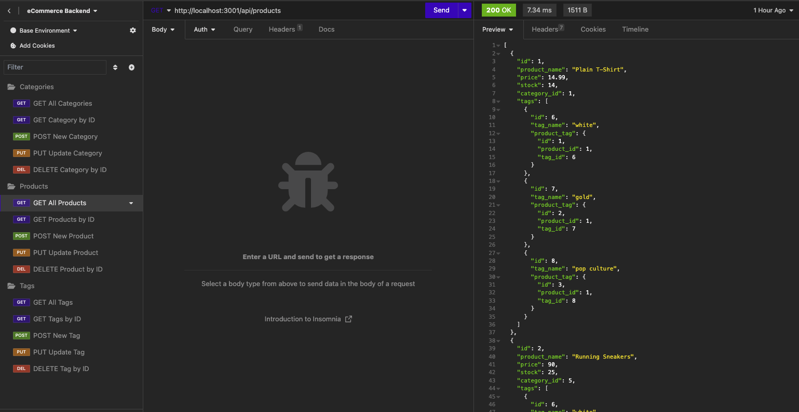
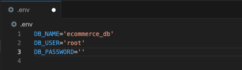
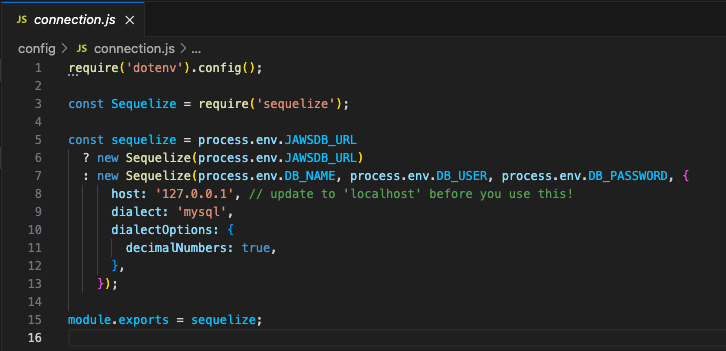
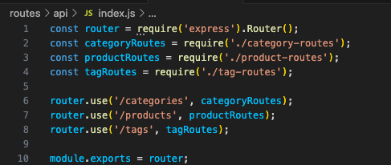
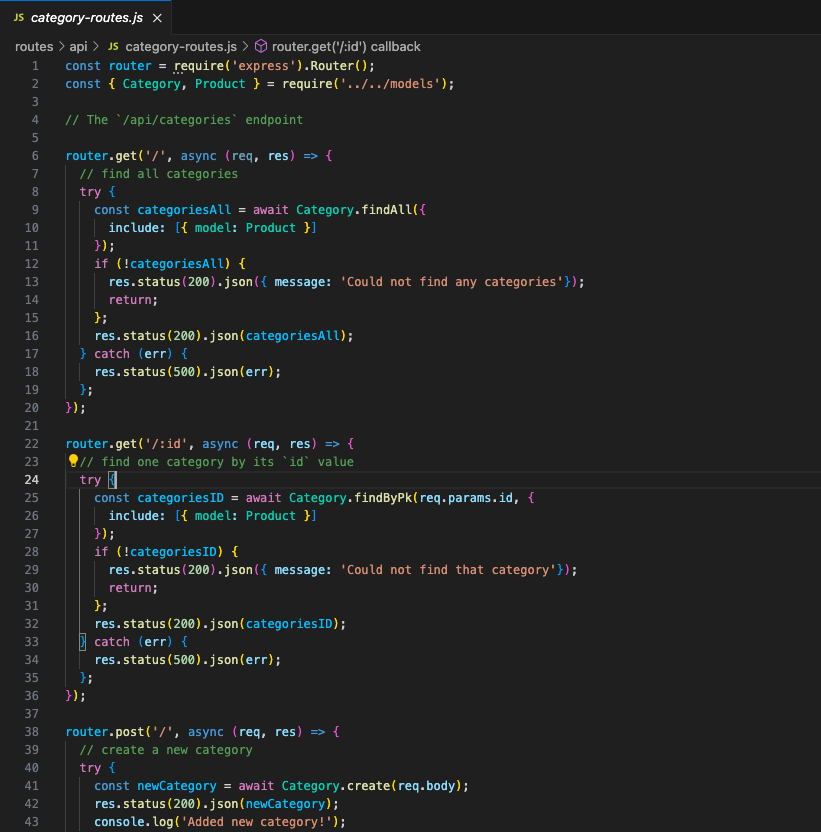
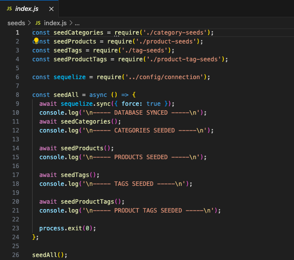
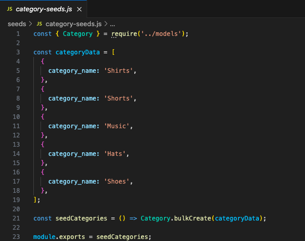
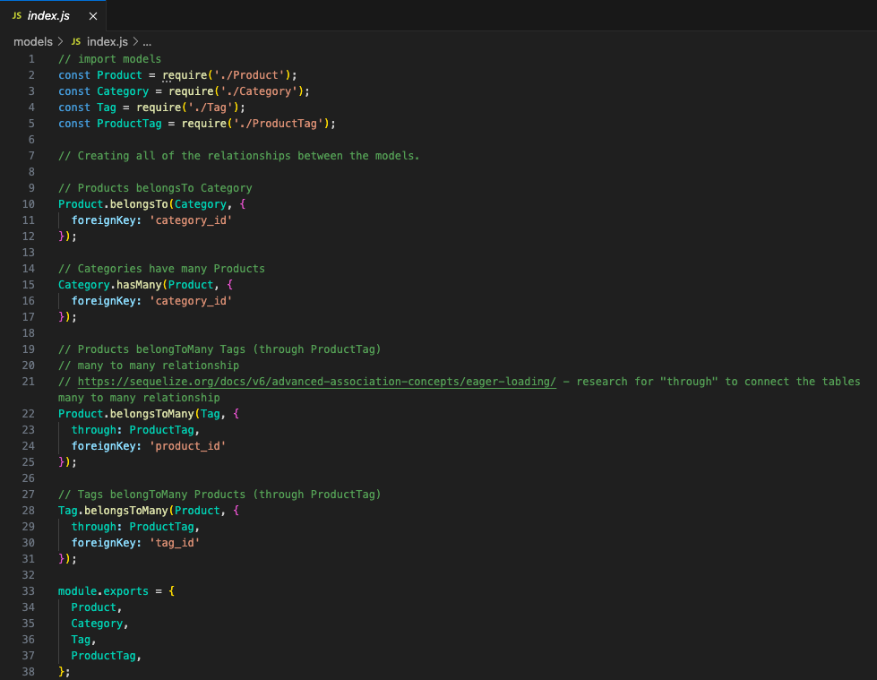
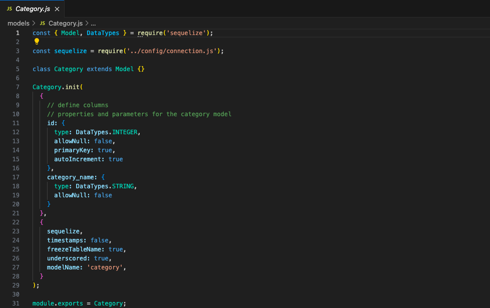

# JANET'S E-COMMERCE BACK END

### [View Project Video Here](https://drive.google.com/file/d/1O8gHk4VnAOfArKtqK63Noh7mkRNdQz1S/view?usp=sharing "JANET'S EMPLOYEE TRACKER")<br />

| Technology Used    | Resource URL |
| --------  | ------- |
| NodeJS      | https://nodejs.org/en |
| ExpressJS      | https://expressjs.com/ |
| dotenv      | https://www.npmjs.com/package/dotenv |
| MySQL      | https://www.mysql.com/ |
| mysql2      | https://www.npmjs.com/package/mysql2 |
| Sequelize  | https://www.npmjs.com/package/sequelize |
| Insomnia | https://insomnia.rest/ |
| Sequel Ace | https://sequel-ace.com/ |
| Screencastify | https://www.screencastify.com/ |
| JavaScript | https://developer.mozilla.org/en-US/docs/Web/JavaScript |
| Git       | https://git-scm.com/ |
| GitHub     | https://github.com/ |
| VSCode    | https://code.visualstudio.com/ |

## Table of Contents

* [Description](#description)
* [Installation](#installation)
* [Usage](#usage)
* [Credits](#credits)
* [License](#license)

## Description:
This project is the backend of an e-commerse database.<br />
<br />

### How to use this app:

* Recommended Requirements: 
  * Node.JS
  * CLI
  * VSCode 
* Installation:
  * Clone the repo to your device 
  * Initiate NPM 
  * Install all dependencies
  * Use MySQL to SOURCE schema.sql
  * Use the terminal to run 'node seeds/index.js'
* Use Integrated Terminal (CLI) 
  * type "npm start" 
* Open Insomnia app
  * Run GET /api for /categories, /products/ and /tags
  * Run GET specific :id /api for /categories, /products/ and /tags
  * Run POST /api for /categories, /products/ and /tags
    * {"name":"value"}
  * Run PUT specific :id /api for /categories, /products/ and /tags
    * {
        "name":"value",
        "decimal":"22.22",
        "number":"18",
        "forgeinkey_id":"4"
      }
  * Run DELETE specific :id /api for /categories, /products/ and /tags

### User Story

```md
AS A manager at an internet retail company
I WANT a back end for my e-commerce website that uses the latest technologies
SO THAT my company can compete with other e-commerce companies
```

### Acceptance Criteria

```md
GIVEN a functional Express.js API
WHEN I add my database name, MySQL username, and MySQL password to an environment variable file
THEN I am able to connect to a database using Sequelize
WHEN I enter schema and seed commands
THEN a development database is created and is seeded with test data
WHEN I enter the command to invoke the application
THEN my server is started and the Sequelize models are synced to the MySQL database
WHEN I open API GET routes in Insomnia for categories, products, or tags
THEN the data for each of these routes is displayed in a formatted JSON
WHEN I test API POST, PUT, and DELETE routes in Insomnia
THEN I am able to successfully create, update, and delete data in my database
```

### Lessons Learned

#### 1. .env file
Using dotenv NPM and utilizing the .env file (while of course adding it to our gitignore) allows us to store our secure login information without sharing it in the repository. As the projects grow this is a crucual security measure to implement.
<br />



#### 2. API Routes
Expanding on API Routes to navigate the database. This was the major task for this project was being able to create and execute the GET, POST, PUT, and DELETE routes. More specifically, the SQL database.
<br />



#### 3. JavaScript seeds
Instead of running schema and seed files through the MySQL shell, we learned to execute JavaScript files to do this work. This is done through Sequelize methods.
<br />



#### 4. Sequelize -> Models
Using Sequelize allows us to do SQL type actions through methods. Instead of us writing long and potentially confusing SELECT statements, we can use this package manager.
<br />



#### Synopsis
We were given a lot of starter code for this project, so the main aspects we had to complete we listed above in the lessons learned.

## Installation

1. Create a new repository on GitHub, to store this project.
2. Clone the repository to your computer.
3. Copy files to your own repository.
4. Follow the steps for "How to" above
5. Make changes to the code.
6. Commit the changes to the local repo.
7. Push the changes to the remote repo.

## Usage

This is an ecommerce backend project. If you would like to use this app follow the installation steps and curate it to your needs. If you would like to use this app, follow the steps under the description 'How to' above and click the link at the top of this page.

## License

MIT License
Copyright (c) 2023 Twixmixy / Janet Webster

<hr />

## About The Author
### Janet Webster
Full Stack MERN Software Engineer in training.

- [GitHub](https://github.com/TwixmixyJanet/)
- [LinkedIn](https://www.linkedin.com/in/twixmixy/)
- [Twitter](https://twitter.com/Twixmixy)
- [WakaTime](https://wakatime.com/@Twixmixy)

